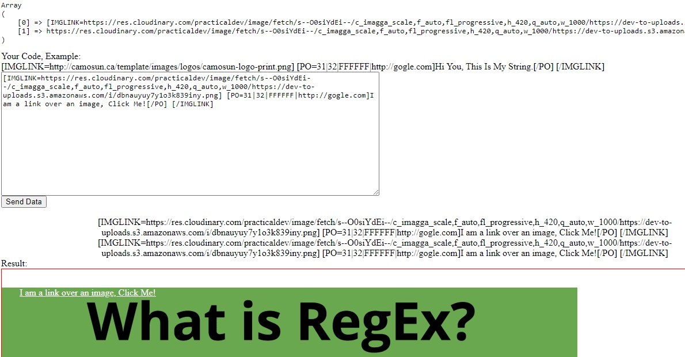

# ImgLink
 Script to generate an image with inner links

Use the Example FORMAT:
```
[IMGLINK=https://res.cloudinary.com/practicaldev/image/fetch/s--O0siYdEi--/c_imagga_scale,f_auto,fl_progressive,h_420,q_auto,w_1000/https://dev-to-uploads.s3.amazonaws.com/i/dbnauyuy7y1o3k839iny.png] [PO=31|32|FFFFFF|http://gogle.com]I am a link over an image, Click Me![/PO] [/IMGLINK]
```
## Example 1

## Example 2

